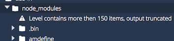
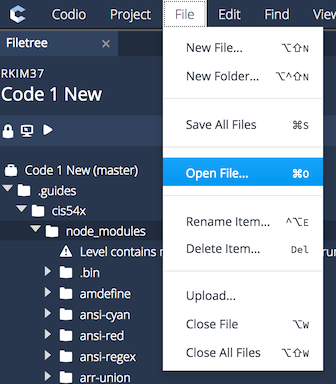

# **CIS54x Unit Test Autograder Package - Codio Version**

This package is intended to be used for eCornell's CIS54x online web design course. It contains unit tests intended to be used by the course's Codio environment.

This README assumes that you are aware of how the Autograder operates and are familiar with its file structure. Regardless, this guide will cover how to adapt this package into any Codio activity.

## **Table of Contents:**

1. Setting Up a Codio Activity
2. Base Installation into Codio
3. Modifying the Mocha "Mochawesome" Reporter
4. Creating an Assessment within Codio

## **1) Setting Up a Codio Activity**

The eCornell organization on Codio requires that coding activities are created as projects. Every project requires a "stack," or a collection of programs that come pre-installed into a project upon first creating said project.

The eCornell CIS 54x has its own custom stack titled **CIS54xDev Ver.2** that contains necessary programs that are used by the Autograder. The programs that come with this stack are:

* Node.JS and npm
* Java (001, 101)
* Mocha
* TestCafe
* http-server
* Google Chrome

In order to create a project within Codio for the CIS 54x online course, you must follow these step.
**Note**: Also ensure that you are part of the eCornell Organization on Codio. Otherwise, you will not have access to the CIS54x Dev stack.

1. Log into Codio
2. From the main homepage of your Codio account, navigate to ``Courses``, then to ``Organizations`` on the top tab. You should find yourself a list of courses affiliated with the eCornell Organization on Codio.
3. Scroll to the course you wish to create a coding activity for, and click it.
4. If you need to create a new module, do so - otherwise, click on the module the coding activity should be a part of.
5. Click the "+" sign to create a new activity. Make sure to click ``Project based unit`` from the dropdown.
6. Look at the partition titled "*Important*" - Click the blue link that follows "*If you want to create a new empty project with a custom stack not listed above*".
7. On the "Empty with Stack" option given, browse for the latest version of ``CIS54xDev Ver.2`` stack.
8. Proceed with the rest of the instructions on the page to create a project.

When you load up the new project, you should already have all the necessary base programs automatically available to you in the project.

## **2) Base Installation into Codio**

Upon creating a new project or when you are in the editor mode of your project, you must upload the CIS 54x Unit Test Autograder Package directly into the package.

1. Within ``.guides`` directory available in Editor mode, create a new cis-specific folder and name it whichever (recommended: "cis54x")

2. Copy the files contained within this directory into the new folder, organized to the extent described below:
	- .guides
		- styles.css
		- cis54x
			- app.js
			- runner.js
			- common.js
			- package.json
			- mocha.opts
			- tests.json
			- tests/
				- (any unit test .js files you need)
				- vnu.jar (if using tests 001 and 101)


3. Using the Terminal tool, change your working directory into the new cis-specific folder. For example:
````
cd .guides/cis54x/
````

4. Install the necessary node modules by entering the following command into the Terminal:
````
npm install
````

5. Remove any unnecessary unit tests from **tests/**

6. Keep track of filepaths. Within the following files, make sure to change the following values as described if you used a different filepath structure than the one provided by this README. **NOTE:** Pay attention to which URLs rely on relative pathing and which rely on absolute pathing
	- ``var vnuPath = ...`` within **common.js**
		- *ABSOLUTE pathing* from root folder of Codio activity - must start from ``.guides/..``
	- ``const common = require(...)`` within any unit tests inside **tests/**
		- *RELATIVE pathing* from test file itself of Codio activity - start from current location of current test file
	- ``var command = ...`` within **app.js**
		- Within the command, pathway within argument of ``mocha.opts``
		- Within the command, pathway within argument of ``runner.js``
		- *ABSOLUTE pathing* from root folder of Codio activity - must start from ``.guides/..``
	- ``--reporter`` within **mocha.opts**
		- *ABSOLUTE pathing* from root folder of Codio activity - must start from ``.guides/..``, lead to ``node_modules/...``
	- ``--reportDir`` within **mocha.opts**
		- *ABSOLUTE pathing* from root folder of Codio activity - must start from ``.guides/..``
		- make sure that there are NO spaces at any point within this line of code

## **3) Modifying the Mocha "Mochawesome" Reporter**

The Mocha package does not use any of its default reporters, but rather uses a 3rd-party reporter called **Mochawesome**. This package also usually comes with another package called **Mochawesome-Report-Generator**. These packages produce HTML and JSON report files once initialized, and these files present the results of the Mocha tests that is more readable and stylized.

In order for the **Mochawesome** reporter to work to our specifications, there are several small changes we must make to the default **Mochawesome** and **Mochawesome-Report-Generator** packages.

### A Thing to Note About Codio Before Modifying The Reporter...

Modifications require that we replace two files:
* The **app.css** file that came with the CIS54x package
* The **utils.js** file that also came with the CIS54x package

Inside Codio, the **Mochawesome** and **Mochawesome-Report-Generator** are both located inside the *node_modules* directory created where you first installed all the Node.JS packages. **HOWEVER**, due to the nature of Codio, if you were to open up this directory within the File Tree, there may be the off-chance that you won't be able to see those directories due to this message:



If this situation happens, then you cannot access the two module packages we need to modify. To that end, this README provides two ways you can alter the packages:

* via **Deletion/Replacement** - If you have access to these packages, then the modification is merely replacing some files
* via **Copy/Paste** - If you do not have access to these packages, then the modification requires altering code directly.

### Modifying Files via Deletion/Replacement

Inside Codio, there is the option to update

* Changing **"app.css"**
	1. Go to the "mochawesome-report-generator" package directory
	2. Locate the "dist" directory within
	3. Replace the current "app.css" within, with the version provided by the CIS54x package

* Changing **"utils.js"**
	1. Go to the "mochawesome" package directory
	2. Locate the "dist" directory within
	3. Replace the current "utils.js", with the version provided by the CIS54x package

### Modifying Files via Copy-Paste

This way of modification is only needed if you cannot access the directories of these Node.JS packages.

To find and modify a file within Codio, you must go to the toolbar at the top, look under "File", and then select **"Open File"** - this will let you open and change the contents of any file within your Codio project.



Below are the default filepaths for ``app.css`` and ``utils.js``, the two files you must change.
**NOTE:** if you structured the autograder package differently, you must be careful to change the filepaths to where ``node_modules/`` is located.

| File     | Pathway |
|:---------|:--------|
| app.css  | ``.guides/cis54x/node_modules/mochawesome-report-generator/dist/app.css`` |
| utils.js | ``.guides/cis54x/node_modules/mochawesome/dist/utils.js`` |

Once you have access to these files, it is a simple matter of copying the contents of each file respectively from the files provided and pasting them into their corresponding files inside ``node_modules/``.

## **4) Creating an Assessment within Codio**

Codio allows an editor to create two types of assessments. This package would require the use of the Advanced Assessment Creator.

1. From the Editor, click the "horse" image and select "Advanced Assessment Test"
2. Name and describe the test whichever way you wish
3. Within the "Command Line" input, type in the following:
		env TESTS=.guides/cis54x/tests.json node .guides/cis54x/app.js
	- All paths should be treated as if the command was executed from the root directory, or './'.
4. Save the assessment

If all paths have been properly defined in Steps 1 and 2, then the assessment should run properly.
