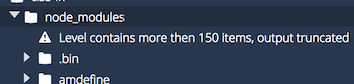
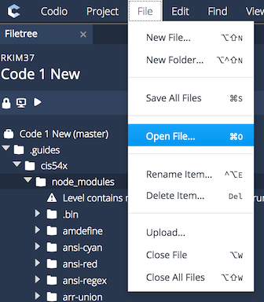

# **CIS54x Unit Test Autograder Package**

This package is intended to be used for eCornell's CIS54x online web design course. It contains unit tests intended to be used by the course's Codio environment.

The Unit Test Autograder runs off of Node.JS and can be installed into any machine, virtual or local, to grade assignments focused on HTML, CSS, and JavaScript.

### Table of Contents:
1. Files, Node.JS Modules, and Other Contents Present within the CIS54x Package
	- Necesary Files, Folders, etc.
	- Necesary Node.JS Modules That Need to be Installed Globally
	- Optional Files/Folders/Modules
2. Unit Tests Provided With the Package
3. Running the AutoGrader On Your Local Machine
	- Base Installation
	- Workflow Of the Autograder
	- Adjusting Settings
		- Commands
		- Inside "mocha.opts"
		- Inside "tests.json"
		- Inside "common.js"
	- Warnings and Considerations
3. Base Installation into Codio
	- Part 1: Initializing A Codio Project With the CIS54x Stack
	- Part 1.5: Personal Projects With the CIS54x Stack
	- Part 2: Importing the CIS54x Package Into Your Project
	- Part 3: Modifying the Mocha "Mochawesome" reporter
	- Part 4: Modifying the Editor Settings within Codio
	- Part 5: Creating an Assessment within Codio

----
## **1) Files, Node.JS Modules, and Other Contents Present within the CIS54x Package**

## Necessary Files, Folders, etc.

All of the files and/or directories listed here are **necessary** for the operation of the autograder.

| File/Directory | Purpose | Additional Notes |
| -------------- | ------- | ---------------- |
| ``app.js``		 | The main Node.JS file the autograder runs off | ``env TESTS=path/to/tests.json node app.js`` |
| ``runner.js``  | The Mocha runner that runs all Mocha tests.<br>Can be accessed separately from ``app.js`` via the command line. | ``env TESTS=path/to/tests.json mocha --opts path/to/mocha.opts path/to/runner.js`` |
| ``mocha.opts`` | The operations file Mocha uses to define its settings and operations.<br>Necessary for every utilization of this CIS54x package. | *none* |
| ``common.js`` | A Node.JS module that contains functions and global variables that are commonly necessary among all unit tests. | NOT accessible via the command line - it is not a standalone Node.JS application |
| ``tests.json`` | A JSON object file that contains all the necessary unit tests when running the autograder | *none* |
| ``package.json`` | The Node.JS package information that contains information on all node modules currently installed within the Node.JS application | *none* |
| Directories ``001-100/``, ``101-200/``, and ``301-400`` | Directories that contain the unit tests necessary for the package | *none* |
| ``styles.css`` | A CSS stylesheet that isn't pertinent to the autograder itself, but rather is a necessary component within a Codio project that utilizes this autograder package. | Only necessary if this package is used on Codio |
| ``app.css`` | A CSS stylesheet that contains modified styling used by Mochawesome's HTML reports. | This file is to replace the default *"mochawesome-rport-generator"* package that comes with Mochawesome. |
| ``utils.js`` | A JavaScript file, a modified version of the one used by Mochawesome that produces the output needed for the HTML and JSON reports Mochawesome prints out. | This file is to replace the default *utils.js* file used by the Mochawesome package. |

## Necessary Node.JS Modules That Need to be Installed Globally

The autograder runs off of the following Node.JS modules that allow for the tests to run:

| Node.JS Package | Purpose | Online Resource(s) |
| --------------- | ------- | ------------------ |
| ``mocha``				| Testing Framework for this CIS54x Autograder Package | [Website](https://mochajs.org/) |

## Optional Files/Folders/Modules

While these files, folders, and modules are not necessary, some of these mentioned **ARE** necessary for certain unit tests. Which unit tests require the following files/folders/modules are mentioned in parentheses next to each file.

| Optional File/Directory/Modules | Type     			| Purpose                   																											| Additional Notes		|
| ------------------------------- | ------------- | ------------------------------------------------------------------------------- | ------------------- |
| ``vnu.jar``                     | File      		| Used to validate HTML and CSS for errors 																				| Unit Tests 001, 101 |
| ``tests/``                      | Directory 		| Contains other files and directories used for testing the unit tests themselves | *none* 							|
| ``testJSONS/``                  | Directory 		| Contains the ``tests.json`` files used to test the unit tests of the autograder | *none* 							|
| ``testcafe`` 										| Global module	| A Node.JS test framework used for certain unit tests.<br>Separate from Mocha, but the autograder utilizes this framework temporarily when testing DOM properties or JavaScript functionality on the DOM | Unit Test 103<br>``npm install -g testcafe`` 	 |
| ``http-server``									| Global module | a Node.JS module that allows files to be hosted on a localserver.<br>Used in conjunction with TestCafe to test DOM properties and JavaScript functionality on DOM elements | Unit Test 103<br>``npm install -g http-server`` |
| ``Google Chrome``								| Application		| Used in conjunction with ``testcafe`` and ``http-server`` to host websites for testing DOM properties and JavaScript functionality | *[1]* |
| ``html-beautifier`` | Global module | Used to generate a reformatted HTML file for Unit Test 303 | Unit Test 303<br>``npm install -g html-beautifier`` |

*[1] To install Google Chrome via the Bash Terminal Command Line, you must execute the following commands in order:*

		wget -q -O - https://dl-ssl.google.com/linux/linux_signing_key.pub | sudo apt-key add -

		sudo sh -c 'echo "deb https://dl.google.com/linux/chrome/deb/ stable main" >> /etc/apt/sources.list.d/google.list'

		sudo apt-get update

		sudo apt-get install google-chrome-stable

----
# **2) Unit Tests Provided With the Package**

The CIS54x Unit Test Autograder Package comes with the following unit tests pre-packaged.
*Those contained within brackets [] are optional variables*

## 001-100 Unit Tests --- HTML-Related

| 001-100 Unit Tests | Function | Variables | Necessary Additional Files/Modules |
| ------------------ | -------- | --------- | ---------------------------------- |
|``001-validate-html.js``|Looks for HTML errors in an HTML file or all HTML files in a given directory|``HTML_PATH``: *string* : file or directory<br>``[SUPPRESS]``: *boolean* : suppress errors involved with doctype or missing title in head|``vnu.jar``|
|``002-element-exists.js``|Looks if an HTML tag is present within an HTML file|``HTML_PATH``: *string* : path to HTML file<br>``SELECTOR``: *string* : CSS selector of HTML element needed to be searched for<br>``[EXISTS]``: *boolean* : Should the element exist or not exist?|*none*|
|``003-resource-exists.js``|Checks if the **src** files of certain elements load properly in the browser for the index page of a website|``DIR_PATH``: *string* : path to the root directory of a website<br>``SELECTOR``: *string* : CSS selector for element - MUST be an ``img`` selector|- ``TestCafe`` <br>- ``http-server``<br>- ``Google Chrome``|

## 101-200 Unit Tests --- CSS-Related

| 101-200 Unit Tests | Function | Variables | Necessary Additional Files/Modules |
| ------------------ | -------- | --------- | ---------------------------------- |
|``101-validate-css.js``|Looks for CSS errors in a CSS file or all CSS files in a given directory|``CSS_PATH``: *string* : file or directory| ``vnu.jar`` |
|``102-declaration-exists.js``|Looks if an CSS declaration is present within a CSS file|``CSS_PATH``: *string* : path to CSS file<br>``PROPERTY``: *string* : CSS property needed to be searched for<br>``[SELECTOR]``: *string* : looks for specified PROPERTY inside any CSS declarations matching the SELECTOR<br>``[VALUE]``: *string* : looks for specified PROPERTY with specified VALUE<br>``[EXISTS]``: *boolean* : Should the declaration exist or not exist?| *none* |

## 301-400 Unit Tests --- File-Related

| 301-400 Unit Tests | Function | Variables | Necessary Additional Files/Modules |
| ------------------ | -------- | --------- | ---------------------------------- |
|``301-file-exists.js``|Checks if a given file or directory exists|``PATH``: *string* : file or directory| *none* |
|``302-image-files.js``|Checks if all images are located in the same base directory|``ROOT_DIR``: *string* : path to root directory of website<br>``[IMAGES_DIR]``: *string* : directory where all images must be based inside| *none* |
| ``303-formatting.js`` | Checks if the indicated files are formatted properly via fuzzy testing and file comparisons | ``PATH``: *string* : file or directory<br>``[SIMILARITY]``: *string/double/integer*: parameter of similarity, files must be >= suggested format in similarity (default = 0.75 or "75%")<br>``[INDENTATION_ONLY]``: *boolean*: Check for only indentation or whole format (default = false)<br>``[FILETYPES]``: *string/array of strings*: which types (html or css or both) autograder should check for (default = ["html", "css"]) | ``html-beautifier`` |

# **3) Running the AutoGrader On Your Local Machine**

## Base Installation

While installation is relatively easy, there are certain actions that MUST be taken for the program to work as intended.

1. In your Bash Terminal, change the working directory to the root folder of where you have placed the CIS54x package.

2. Use the following command to install the necessary Node.JS modules:
		npm install

3. You must install **mocha** globally into your local machine. You may do so with the following command:
		sudo npm install -g mocha
4. You must replace the following two files over their defaults. If you are feeling paranoid, feel free to create copies of the original **mochawesome** and **mochawesome-report-generator** folders before replacing the following files.

	- **utils.js**
		- *This file replaces:* ``node_modules/mochawesome/dist/utils.js``
	- **app.css**
		- *This file replaces:* ``node_modules/mochawesome-report-generator/dist/app.css``

## Workflow Of the Autograder

The CIS54x Unit Test Autograder performs its functions in the following order by default:

1. User executes ``env TESTS=tests.json node app.js`` while the current working directory within the Bash terminal is the root folder where ``app.js`` is located
2. ``app.js``:
	- Gets the path to ``tests.json`` via the Environmental Variable executed alongside the command above
	- Executes a Child Process command: ``env TESTS=tests.json mocha --opts mocha.opts runner.js``
3. Retrieves the Mocha reporter settings defined within ``mocha.opts``
4. ``runner.js``:
	- Scans ``tests.json`` for the list of unit tests it must execute - Ends prematurely with Exit Code 1 if no ``tests.json`` was provided.
	- Synchronously runs each unit test provided inside ``tests.json`` - every unit test is its own mocha test suite
	- Prints out Mocha test results using ``mochawesome`` - produces a ``testReport/`` folder with ``report.html``, alongside other files
5. Back to ``app.js``
	- Once the Runner finishes its testing, the Autograder performs according to whether the tests returned any failed suites or not.
	- If the runner returns any failed suites, the program terminates with Exit Code 1 and with any error messages outputted via the terminal
	- If the runner doesn't return any failed suites, the program terminates with Exit Code 0.

To view the results of the Autograder's testing, simply open up ``report.html`` that is located within the newly made ``testReport/`` directory.

Additionally, it is entirely possible to run ``runner.js`` without relying on ``app.js`` - one simply needs to execute ``env TESTS=tests.json mocha --opts mocha.opts runner.js`` within the Bash Terminal, as the program will output a ``report.html`` that can be viewed regardless.


## Adjusting Settings

Should the need arise, certain options can be altered to allow the Autograder to work per the needs of the user.

### Commands

It is imperative that certain pathways to files are altered within each command to ensure that files are properly linked to.

| Command | Location of Execution | Pathways to Alter |
| ------- | --------------------- | ----------------- |
| ``env TESTS=tests.json node app.js`` | Bash Terminal | - ``tests.json`` (located by default within the same directory as ``app.js``)<br>- ``app.js`` |
| ``env TESTS=tests.json mocha --opts mocha.opts runner.js`` | Bash Terminal OR within ``app.js`` |- ``mocha.opts``<br>- ``runner.js``<br>- ``tests.json`` (ONLY if executed via Bash Terminal - if executed via ``app.js``, it will inherit defined pathway within the command executed to run ``app.js``) |

###  Inside "mocha.opts"

Within ``mocha.opts``, there are several defined options pre-set to work by default. These options are meant to alter the behavior of the **Mocha** testing framework and the **Mochawesome** reporter used in conjunction with Mocha.

| Option | Description | Default Value | Additional Notes |
| ------ | ----------- | ------------- | ---------------- |
| ``--reporter`` | Tells Mocha which reporter it should use | ``node_modules/mochawesome/dist/mochawesome.js`` | The Mocha framework uses a forked, local version of **Mochawesome** on purpose - this is due to alterations with the **Mochawesome** reporter made for the CIS54x Autograder |
| ``--reporter-options`` | Defines options for **Mochawesome** - MUST be a single string delimited by commas (for this readme, separated by newlines) | ``showPending=false``<br>``enableCode=false``<br>``reportDir=testReport/``<br>``reportFilename=report``<br>``charts=false`` |- ``showPending``: shows/hides pending tests from showing<br>- ``enableCode``: shows/hides code used within each unit test<br>- ``reportDir``: defines inside which directory ``report.html`` and its related files are to be saved in<br>- ``reportFilename``: what the Mochawesome output file(s) should be saved as (doesn't include .extension)<br>``charts``: shows/hides graphic detailing how many tests each suite passed and failed |
| ``--timeout`` | Sets the timeout period for each unit test | ``20000`` | Recommended to be a period at least greater than ``15000`` to allow certain time-taking unit tests (ex. 001) to perform their operations |

A full list of additional options for **Mochawesome** that can be altered are provided [here](https://www.npmjs.com/package/mochawesome) and [here](https://www.npmjs.com/package/mochawesome-report-generator).

### Inside "tests.json"

Within ``tests.json`` are the unit tests that are meant to be executed by the Autograder upon each run. You may link to any unit test file provided by the Autograder, or any custom unit test that you may wish to use. For each unit test you wish to define, here are the common values you must define for the unit test to operate properly.

* **Note**: Those wrapped by brackets [] are optional; those marked with an asterisk ``*`` are those where certain unit tests have predefined these and cannot be altered via ``tests.json``

*Be aware that any links provided are relative to ``runner.js``, meaning that if a unit test file is located one directory lower than ``runner.js`` you must adjust properly.*

| Value | Description | Value Type | Example |
| ----- | ----------- | ---------- | ------------- |
| ``title`` | The title that defines your unit test | string | "title":"P tag existence" |
| ``test`` | Pathway to where the unit test file is located | string | "test":"001-100/002-element-exists.js" |
| ``[statement]`` | Message that usually defines what you may expect for the test to return a success | string | "statement":"Expect p tag to be present" |
| ``[error_message]`` | The error message that appears if a unit test returns a failure | string | "error_message":"P tag was not found!" |
| ``[hints]`` * | Defines whether any hints should appear for failed tests<br>``001`` and ``101`` are predefined to output hints regardless | string or ``false`` (boolean) | "hints":"Check for mispellings\nMake sure you haven't forgotten to add them into your code" |
| ``variables`` | Each unit test requires certain unique variables to operate properly<br>Refer to **Unit Tests Provided With the Package** for a list of variables for each unit test | object list, containing various value types | "variables":{ "HTML_PATH":"./example.html", "SELECTOR":"p", "EXISTS":true }

### Inside "common.js"

There is a single variable named ``vnuPath`` defined within this file. All that is necessary is to ensure that the defined pathway to ``vnu.jar`` is set so that it is relative to **the unit test that requires it**, not ``runner.js`` or ``app.js``.

## Warnings and Considerations

There are several things to keep track of when using the package within your local machine:

1. Make sure you've set your working directory to the root directory of the CIS54x package
2. Make sure that you have the most up-to-date Node.JS modules installed
3. Make sure that you have the necessary modules installed globally (**mocha**)
4. Make sure that **tests.json** contains the appropriate pathways and variables
	- **Remember:** all pathways defined within this file must be treated as if you were relative to ``runner.js``
5. Make sure that you've replaced **app.css** and **utils.js** appropriately
6. Make sure that the **mocha.opts** folder contains the proper pathways and settings
7. Make sure that the ``vnuPath`` variable defined within ``common.js`` is linked properly to ``vnu.jar``, relative to the unit tests that require that file
8. If you wish to run the tests from **runner.js** and not **app.js**, then make sure that ``tests.json``, ``mocha.opts``, and ``runner.js`` have their paths properly defined

# **4) Base Installation into Codio**

## Part 1: Initializing A Codio Project With the CIS54x Stack

The eCornell organization on Codio requires that coding activities are created as projects. Every project requires a "stack," or a collection of programs that come pre-installed into a project upon first creating said project.

The eCornell CIS 54x has its own custom stack that contains necessary programs that are used by the Autograder. The programs are:

* Node.JS and npm
* Java (001, 101)
* Mocha
* TestCafe
* http-server
* Google Chrome

In order to create a project within Codio for the CIS 54x online course, you must follow these step.
**Note**: Also ensure that you are part of the eCornell Organization on Codio - if you are creating the project for your own purposes, go to "**Part 1.5: Personal Projects With the CIS54x Stack**":

1. Log into Codio
2. From the main homepage of your Codio account, navigate to ``Courses``, then to ``Organizations`` on the top tab. You should find yourself a list of courses affiliated with the eCornell Organization on Codio.
3. Scroll to the course you wish to create a coding activity for, and click it.
4. If you need to create a new module, do so - otherwise, click on the module the coding activity should be a part of.
5. Click the "+" sign to create a new activity. Make sure to click ``Project based unit`` from the dropdown.
6. Look at the partition titled "*Important*" - Click the blue link that follows "*If you want to create a new empty project with a custom stack not listed above*".
7. On the "Empty with Stack" option given, browse for the latest version of ``CIS 54x Dev. Stack``.
8. Proceed with the rest of the instructions on the page to create a project.

When you load up the new project, you should already have all the necessary base programs automatically available to you in the project.

## Part 1.5: Personal Projects With the CIS54x Stack

If you wish to create a project for personal reasons or for testing purposes on your own private Codio account, the process for doing so is very similar to **Part 1**'s. The only differences are how you initialize the project creation process.

1. From the main homepage of your Codio account, go to ``My Projects`` from the sidebar on the left.
2. On the top right, click ``New Project``
3. Click the blue link that says "Click here" below all the options to available stacks suggested by Codio.
4. Continue onto Step #7 from **Part 1**.

## Part 2: Importing the CIS54x Package Into Your Project

Upon creating a new project or when you are in the editor mode of your project, you must upload the CIS 54x Unit Test Autograder Package directly into the package.

1. Within ``.guides`` directory available in Editor mode, create a new cis-specific folder and name it whichever (recommended: "cis54x")
2. Copy the necessary files into the new folder:
	- Necessary files:
		- app.js
		- runner.js
		- common.js
		- package.json
		- mocha.opts
		- tests.json
		- (any unit test .js files you need)
	- Optional files Based on the Unit Tests you wish to implement:
		- vnu.jar

3. Using the Terminal tool, change your working directory into the new cis-specific folder. For example:
		cd .guides/cis54x/

4. Install the necessary node modules by entering the following command into the Terminal:
		npm install

5. Within the following files, make sure to change the following values as described. This is because Codio, whenever running an assessment, will run from the root folder ("./"). As such, you must repath the necessary files as if you were starting from the root directory.
	- **var vnuPath = ...** within **.guides/cis54x/common.js"**
		- Change value to ``.guides/cis54x/vnu.jar``
	- **const common = require(...)** within any unit tests added
		- Change value to wherever ``common.js`` is located, relative to the CURRENT unit test file you are editing
	- **var command = ...** within **.guides/cis54x/app.js**
		- Within the command, change the argument after ``--opts`` to ``.guides/cis54x/mocha.opts``
		- Within the command, change the last argument from ``./runner.js`` to ``.guides/cis54x/runner.js``
	- **--reporter** and **--reporter-options** within **.guides/cis54x/mocha.opts**
		- Within the command ``--reporter``, change the value such that ``node_modules`` is pointed to appropriately. For example:
				--reporter .guides/cis54x/node_modules/mochawesome/dist/mochawesome.js
		- Within the command ``--reporter-options``, change the value such that the value of ``reportDir`` is altered to as described (make sure that there are NO spaces at any point within this line of code):
				--reporter-options ...reportDir=.guides/testReport/,...
	- **Comments** within **.guides/cis54x/app.js**
		- Within the callback of **var child**, make sure to uncomment the following **AND** comment out everything else:
				``
				if (error) {
					var output = '<iframe src=".guides/testReport/report.html" style="display:block;width:100%;margin:auto;min-height:600px;border:none;"></iframe>';
					process.stdout.write(output);
					process.exit(1);
				} else {
					process.stdout.write("Well Done!");
					process.exit(0);
				}
				``
	- All tests within **.guides/cis54x/tests.json**
		- All **"test"** variables within each test must be treated as if you're looking from the cis-specific folder. On the flip side, all variables defined within the "variables" object for each test must be treated as if you're looking from the root "./" folder.
		- For example, one test should look like this:
				{
					"title":"Check for existence of <section> within <article>:",
					"test":"./002-element-exists.js",
					"variables":{
						"HTML_PATH":"./index.html",
						"SELECTOR":"article section"
					}
				}
		- Notice that "test" is NOT **".guides/cis54x/002-element-exists.js"**, but rather **"./002-element-exists.js"**
		- Similarly, notice that "HTML_PATH" within "variables" is NOT **"../../index.html"**, but rather simply **"./index.html"**

Your Codio file tree must ultimately look something similar to such:

		- ... (files and directories necessary for student activity, i.e. index.html)
		- .guides/
			- styles.css 	<- used to make alterations to appearance of codio framework
			- ... (Other files used by Codio)
			- cis54x/
				- app.js
				- runner.js
				- common.js
				- tests.json
				- mocha.opts
				- packages.json
				- node_modules/ 	<- created when you execute "npm install"
				- vnu.jar 	<- necessary for 001 and 101
				- (all your unit test .js files)
			- testReport/		<- created when mochawesome finishes testing student code
				- assets/		<- created when mochawesome finishes testing student code
				- report.html 	<- created when mochawesome finishes testing student code

## Part 3: Modifying the Mocha "Mochawesome" reporter

The Mocha package does not use any of its default reporters, but rather uses a 3rd-party reporter called **Mochawesome**. This package also usually comes with another package called **Mochawesome-Report-Generator**. These packages produce HTML and JSON report files once initialized, and these files present the results of the Mocha tests that is more readable and stylized.

In order for the **Mochawesome** reporter to work to our specifications, there are several small changes we must make to the default **Mochawesome** and **Mochawesome-Report-Generator** packages.

### A Thing to Note About Codio Before Modifying The Reporter...

Modifications require that we replace two files:
* The **app.css** file that came with the CIS54x package
* The **utils.js** file that also came with the CIS54x package

Inside Codio, the **Mochawesome** and **Mochawesome-Report-Generator** are both located inside the *node_modules* directory created where you first installed all the Node.JS packages. **HOWEVER**, due to the nature of Codio, if you were to open up this directory within the File Tree, there may be the off-chance that you won't be able to see those directories due to this message:



If this situation happens, then you cannot access the two module packages we need to modify. To that end, this README provides two ways you can alter the packages:

* via **Deletion/Replacement** - If you have access to these packages, then the modification is merely replacing some files
* via **Programmatically** - If you do not have access to these packages, then the modification requires altering code directly.

### Modifying Files via Deletion/Replacement

Inside Codio, there is the option to update

* Changing **"app.css"**
	1. Go to the "mochawesome-report-generator" package directory
	2. Locate the "dist" directory within
	3. Replace the current "app.css" within, with the version provided by the CIS54x package

* Changing **"utils.js"**
	1. Go to the "mochawesome" package directory
	2. Locate the "dist" directory within
	3. Replace the current "utils.js", with the version provided by the CIS54x package

### Modifying Files via Programmatically

This way of modification is only needed if you cannot access the directories of these Node.JS packages.

To find and modify a file within Codio, you must go to the toolbar at the top, look under "File", and then select **"Open File"** - this will let you open and change the contents of any file within your Codio project.



* Changing **"app.css"**
	1. Search for a file using the **Open File** function mentioned above:
			path/to/node_modules/mochawesome-report-generator/dist/app.css
	2. Within this file, change the following selectors and their values. Make sure you alter ONLY the properties mentioned and not the other properties defined within that selector's CSS.
		````
		.suite--filename---3LR5s
				display:none;

		.suite-summary--component---1-m65
				display:none;

		.h3,h3
				font-size:16px;

		.test--title---278p8
				font-size:12px;
		````
	3. Find the part of code shown below and add the new CSS declaration as defined:
	````
	.test--duration---16Zhh {
			-webkit-transition:color .2s ease-out;
			transition:color .2s ease-out;
			display:none;	// <-- ADD THIS DECLARATION AND VALUE
	}
	````
	4. Find the part of code shown below and add the new CSS declaration as defined:
	````
	.test--duration-icon---2Bpxk {
			margin-left:4px;
			line-height:24px!important;
			color:rgba(0,0,0,.38);
			display:none;	// <-- ADD THIS DECLARATION AND VALUE
	}
	````
	5. Find the part of code shown below and add the new CSS declaration as defined:
	````
	.test--code-snippet---anpV7+.test--code-snippet---anpV7 {
			border-top:1px solid #fff;
			display:none;	// <-- ADD THIS DECLARATION AND VALUE
	}
	````

* Changing **"utils.js"**
	1. Search for a file using the **Open File** function mentioned above:
	 		path/to/node_modules/mochawesome/dist/utils.js
	2. Within this file, change the following piece of code as defined below.
		- Within the ``if (name && message)`` conditional, alter the variable ``errMessage`` so that it equals ``stripAnsi(message).split(/:(.+)/)[0]``:
	````
	function normalizeErr(err, config) {

			... // unimportant variable declarations and such

			if (name && message) {
	    		//errMessage = name + ': ' + stripAnsi(message);
	    		errMessage = stripAnsi(message).split(/:(.+)/)[0];
			} else if (stack) {
	    		errMessage = stack.replace(/\n.*/g, '');
			}

			... // rest of the function, not important
	}
	````

## Part 4: Modifying the Editor Settings within Codio

There are certain default behaviors that the code editor within a Codio Project will perform in its attempts to make coding easier (i.e. auto-complete, auto-indentation). For the purposes of the course, we will have to suppress this sort of behavior in order to prevent students from relying too much on these shortcuts.

To alter these settings, within every Codio project is a file called ``.settings``. This file contains all the settings the editor and Codio project uses, and we can modify its values directly.

Open the ``.settings`` file. Right below the ``[editor]`` (line 1), is an example of the kinds of modification we can do: ``tab_size``. We do not need to edit this line, but right below ``tab_size = 2`` you must copy-paste the following:

````
automatic_completions = false
auto_close_tags_when_opening = false
auto_close_tags_when_closing = false
smart_indent = false
auto_close_brackets = false
````

These values will suppress behavior that can act like shortcuts, preventing students from accessing these while typing out code.


## Part 5: Creating an Assessment within Codio

Codio allows an editor to create two types of assessments. This package would require the use of the Advanced Assessment Creator.

1. From the Editor, click the "horse" image and select "Advanced Assessment Test"
2. Name and describe the test whichever way you wish
3. Within the "Command Line" input, type in the following:
		env TESTS=path/to/tests.json node path/to/app.js
	- All paths should be treated as if the command was executed from the root directory, or './'.
	- For example, the **path/to/tests.json** would look something like:
			... TESTS=.guides/cis54x/tests.json
	- Likewise, **path/to/app.js** would look something like this:
			... node .guides/cis54x/app.js
4. Save the assessment

If all paths have been properly defined in Steps 1 and 2, then the assessment should run properly.
